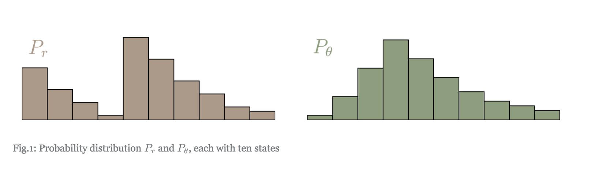
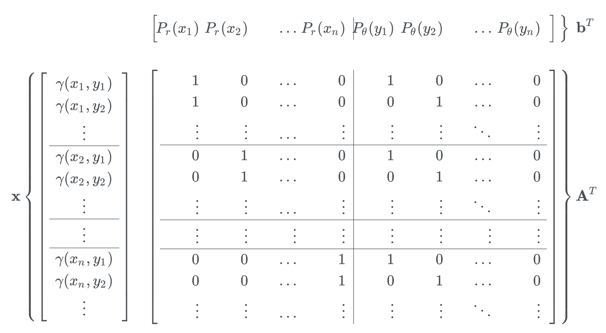
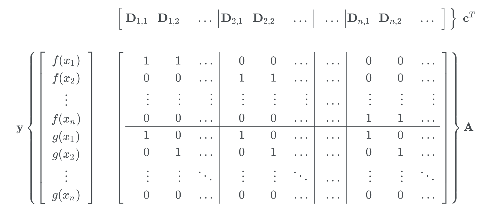
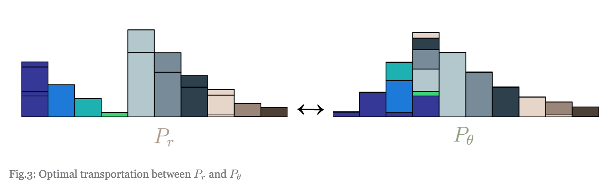
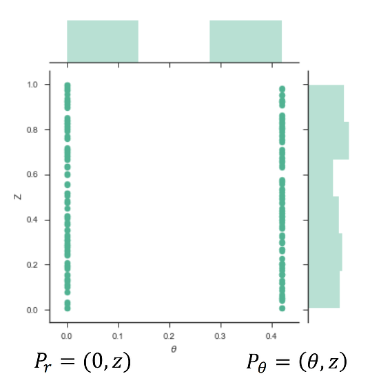
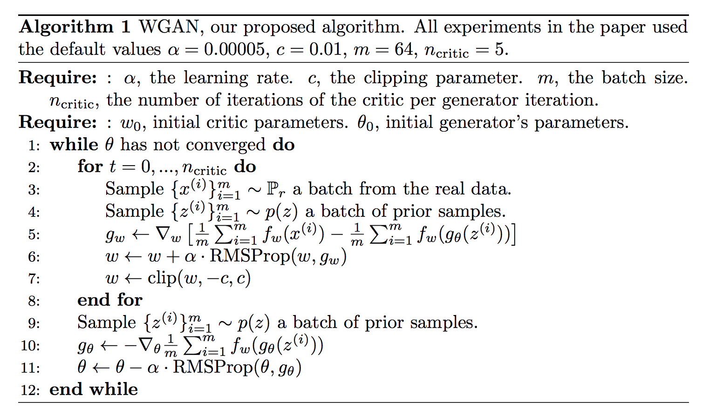

## WGAN

WGAN은 기존의 $f-GAN$의 확장으로 볼 수 있는 GAN의 많은 variant 중의 하나입니다. 2014년 GAN이 세상에 선을 보인 후로, GAN이 변형된 수많은 모형이 나왔습니다. 그 중 Google의 DC-GAN이 안정적인 추정을 위한 guide line을 제시하였다면, WGAN은 학습이 잘 안되는 이유를 KL divergence의 한계로 언급하며, loss function을 재정의하여 안정성을 제고합니다. 여기에서는 Wasserstein distance에 대해서 자세히 알아보도록 하겠습니다.


## Wasserstein distance

두개의 분포 $P_r$와 $P_\theta$ 사이의 거리를 재는 방법은 여러가지가 있습니다. 분포 간의 거리를 재는 Wasserstein distance는 다음과 같이 정의됩니다.

$$W_p(P_r, P_\theta) = \inf_{\gamma \in \Gamma}E_{(x,y) \sim \gamma(x, y)}\left(|x-y|^p\right)$$

Wasserstein distance는 두개의 주변 확률 분포를 일치시키기 위해 하나의 분포를 다른 분포로 변화시키기 위해 mass를 옮기는 과정(transportation plan)을 상상합니다. 머신러닝 분야에서는 이 거리를 Earth Moving distance라고 하는데 mass를 움직임을 은유적으로 표현한 것이 아닌가 싶습니다. 결론부터 말하자면, Transportation plan은 결합확률분포의 다른 표현입니다. 그 이유는 다음과 같습니다.




먼저 각각의 분포가 $l$개의 bin으로 구분되어 있다고 생각합니다. $x$를 $P_r$의 support에 있는 bin으로, $y$를 $P_\theta$의 support에 있는 $l$개 bin 중에 하나라고 합니다. $\gamma(x, y)$는 $P_\theta$의 bin $x$로부터 $P_r$의 bin $y$로 움직이는 mass의 크기를 나타냅니다. 예를 들면, $\gamma(1, 3)= .2$는 $P_\theta(1)$의 mass 중 .2를 $P_r(3)$으로 옮기라는 의미입니다. Transportation plan은 다음의 조건을 만족해야 합니다.

$$\int \gamma (x, y) dx = p_\theta(y), \int \gamma(x,y) dy = p_r(x)$$

위의 조건을 만족하는 모든 원소가 비음(non-negative)인 함수 $\gamma(x, y)$는 결합확률분포의 정의와 정확하게 일치합니다.

문제는 과연 어떻게 어떤 순서로 mass를 움직여야 하는가입니다. mass를 움직이는 방법에는 거의 무한대에 달하는 방법이 있습니다. 통계학에서는 "주변확률 분포가 결합확률분포를 결정할 수 없다"라고 하는데, 정확히 transportation plan이 무한히 있다는 말과 일치합니다. Wasserstein distance는 그 중에서도 cost를 가장 작게 하는 방법을 바탕으로 두 분포의 거리를 구합니다. Cost는 mass를 이동해야 하는 거리와 이동해야 하는 mass의 양을 곱한 것입니다.

$$Cost = mass \times distance$$

움직여야 하는 거리는 $\|x -y \|^p$입니다. 여기서 $\|\cdot\|^p$는 $p$차 norm을 의미합니다. mass는 위에서 예를 들어 보여드린 것처럼, $\gamma(x,y)$로 표현됩니다. Cost는 다음과 같이 표현할 수 있습니다.

$$Cost = \sum_{x \in \mathcal X} \sum_{y \in \mathcal Y} \gamma(x, y) \cdot \|x -y \|^p$$

오른편 식을 보면, 변수들이 가질 수 있는 모든 값들의 조합에 대해 확률분포함수와 $\|x - \|^p$의 곱을 더해 놓은 것으로 이는 바로 기대값의 정의와 일치합니다. 그래서 Cost는 다음과 같이 기대값으로 쓸 수 있습니다.

$$Cost = E_{\gamma(x, y)}\left(\|x-y\|^p\right)$$

다시 말하면, Wasswerstein 거리는 주변분포가 주어져 있을 때, 이 두개의 분포를 주변분포로 하는 결합분포 중에서 $E(\|x-y\|^p)$를 가장 작게 하는 분포를 골랐을 때, $\| x - \|^p$의 기대값입니다.

>NOTE: $\inf$는 그 정의가 largest lower bound로 최소값이 해당 셋에 존재하지 않는다 하더라도 최소값을 찾기 위한 수학적 장치라고 보면 되겠습니다. 가장 단순한 예로 $f(x) = \frac 1 {1 + exp (-x)}$의 최소값은 무엇일가요? $x$가 음의 무한대로 가도 위의 함수는 0에 도달할 수 없습니다. 영원히 가까워져 갈 뿐이죠. 이런 경우 $f(x)$의 최소값은 0이라는 말을 할 수 없습니다. 왜냐하면, 0이라는 숫자는 $f(x)$의 치역(range)인 $(0, 1)$이라는 set의 바깥에 있기 때문입니다. 반면,  $f(x)$의 infimum은 0이라는 말을 할 수 있죠. 이렇게 수학적으로 보다 완전성을 기하기 위한 표현입니다. 어차피 discrete한 세상에서 사는 data scientist들은 그냥 단순하게 $\min$로 생각해도 될 것 같습니다.


이렇게 거리는 정의할 수 있습니다만, 거리를 찾는 것이 만만치 않습니다. 거리를 찾는 문제 자체가 최적화 문제가 되어 버렸습니다. $P_\theta$와 $P_r$을 Discrete한 분포라고 가정하면, $\gamma(x,y)$를 다음과 같은 matrix로 나타낼 수 있습니다.

$$\gamma = \left(\begin{array}{ccc} \gamma(x_1, y_1) &\cdots &\gamma(x_1, y_l) \\ \vdots &\cdots & \vdots \\\gamma(x_l, y_1) &\cdots &\gamma(x_l, y_l)\end{array}\right)$$

그리고 support의 원소의 거리를 나타내는 matrix, $D$를 다음과 같이 정의하면,

$$D = \left(\begin{array}{ccc} \|x_1 - y_1\| &\cdots &\| x_1 - y_l\| \\ \vdots &\cdots & \vdots \\\|x_l - y_1\| &\cdots &\|x_l - y_l\|\end{array}\right)$$

위의 두 행렬의 Fabuluous norm으로 기대값을 구할 수 있습니다.
$$ \left<D, \gamma \right>_F =  E_{(x, y) \sim \gamma(x, y)} \|X-y\| $$


$vec$ operator는 행렬을 벡터로 표현하는 operator입니다. 위의 행렬은 길이가 $l^2$인 벡터들로 바뀝니다.

$$d = vec(D), g = vec(\gamma)$$

다음의 cost,
$$c = d^Tg$$

를 최소화하고 싶은 목적함수로 하되, 이 최적화 과정에는 다음과 같은 constraint들이 있습니다.

* $d$의 모든 원소는 0보다 크다
* $\sum_{i=1}^l \gamma(x_i, y) = P_r(y)$
* $\sum_{j=1}^l \gamma(x, y_j) = P_\theta(x)$


위의 조건을 표현하기 위해 적절히 design 행렬 $A$를 정의하면,
<!--
$$A = \left(\begin{array}{c|c|c} [
  \bm 1_{l\times 1}, \bm 0_{l\times (l-1)}] & \ldots & [\bm 0_{l\times (l-1)}, \bm 1_{l\times 1}]\\
\|x_l - y_1\| &\cdots &\|x_l - y_l\|\end{array}\right)$$


$$ x = \left(\begin{array}{c}\gamma(x_1, y_1) \\ \gamma(x_2, y_1) \\ \vdots \\ \gamma(x_l, y_1) \\ \vdots \\ \gamma(x_l, y_l)\end{array}\right), b = \left(\begin{array}{c} P_\theta(x_1) \\ P_\theta(x_2) \\ \vdots \\ P_r(y_1) \\ \vdots \\ P_r(y_l)\end{array}\right)$$
-->



위의 조건 중 두번째 세번째 조건은 다음과 같이 쓸 수 있습니다.
$$A\cdot x =  b$$

요약하면, EM distance를 구하는 것은 다음의 linear programming 문제를 푸는 것과 같습니다.

$$min_{g} c = min_{g} d\cdot g$$

s.t. $g \ge 0$ and $Ax = b$

모든 최적화 문제는 dual problem이 존재합니다. 위 문제의 dual 문제는 다음과 같이 쓸 수 있습니다.

$$ max_{y} \tilde c =  b^T y$$

s.t. $A^Ty \le d$

원래 도출했던 최적화 문제를 primary form이라 하고, 바로 위에 정의된 문제는 dual form이라고 합니다.

linear programming의 정준(canonical) 형태는 강쌍대성(strong duality)가 성립하고, 우리는 두개의 문제 중에 보다 해를 찾아내기 쉬운 문제를 풀면 됩니다. 여기에서는 dual form이 더욱 직관적입니다.

dual form에서 목적함수의 최대값, $\tilde c  = b^T y^* $를 다음과 같이 표현할 수 있습니다.
$$ y^* = \left(\begin{array}{c} \bm f \\ \bf g\end{array}\right)$$
$\bm f$와 $\bm g$는 각각 $\mathbb R^l$에 속해 있습니다. EMD는 다음과 같이 표현할 수 있습니다.

$$EMD(P_\theta, P_r) = \bm f ^T P_\theta + \bm g P_r$$

제약식 $A^Ty$으로부터 다음의 결과를 도출할 수 있습니다.
$$f(x_i) + g(x_i) \le D_{i,j}$$

$D_{i,i}$는 모든 $i$에 대해서 0입니다. 자기 자신과의 거리는 0이기 때문입니다.

$P_\theta$와 $P_r$이 모두 양의 값을 가지므로 (확률의 axiom) EMD를 극대화하기 위해서는 $\bm f^T P_\theta + \bm g^T P_r$이 극대화되는 점이 곧 EMD가 극대화되는 점이고, $f(x_i) \le -g(x_i)$이므로, $f(x_i) = - g(x_i)$인 점에서 극대화 되고, 결국 $\bm f^T P_\theta + \bm g^T P_r$은 0인 경우 EMD가 가장 극대화됩니다. (여기서 EMD를 극대화시킨다는 것은 dual 공간에서 작업하기 때문입니다.)



다음은 python으로 moving cost를 최소화한 transportation plan을 찾는 방법을 simulation 해놓은 예제입니다.
```
import numpy as np
from scipy.optimize import linprog

p_r = (.1, .2, .1, .2, .1, .2, .1)
p_t = (.1, .1, .1, .1, .1, .1, .4)

l = 7
A_r = np.zeros((l,l,l))
A_t = np.zeros((l,l,l))

for i in range(l):
    for j in range(l):
        A_r[i,i,j] = 1
        A_t[i,j,i] = 1  

A = np.concatenate((A_r.reshape((l, l**2)), A_t.reshape((l, l**2))), axis = 0)
b = np.concatenate((p_r, p_t), axis = 0)
c = D.reshape((l**2))
```



지금까지 설명해 놓은 Kantorovich-Rubinstein duality에 의한 Wasserstein distance는 다음과 같이 정의됩니다.

$$ W(P_r, P_\theta) = \sup_{\|f\| \le 1} E_{P_r}(f(X)) - E_{P_\theta}(f(x))$$

이렇게 정의함으로써 우리는 모든 transportation에 대한 $\inf$를 구하지 않아도 됩니다. Lipschitz continuous 함수 중에서 가장 주어진 분포 하에서 기대값을 가장 크게 하는 값이 Wasserstein 거리가 됩니다. $K$- Lipschitz continuous 함수는

$$ |f(x) - f(y) | \le K |x - y|$$

과 같이 정의된 함수로서 함수가 정의된 모든 점에서 함수의 기울기가 $K$보다 작은 함수를 의미합니다. 참고로 이 함수족은 continuous 할 필요는 없습니다.

다음이 성립합니다.

$$\sup_{\|f\| \le K} E_{P_r}(f(X)) - E_{P_\theta}(f(x)) =  K\cdot W(P_r, P_\theta) $$

만약 $K$ - Lipschitz 함수족으로 거리를 정의한다면, 이는 Wasserstein 거리의 $K$배로 정의가 됩니다.

이제 WGAN에 어떻게 위의 거리가 적용되는지를 살펴보겠습니다.

#### WGAN의 학습 알고리즘


WGAN의 motivation은 다음과 같습니다. Generator 신경망은 생성된 데이터의 분포와 진짜 데이터의 분포를 비슷하게 만들기 위해서 노력합니다. 다음은 GAN의 loss 함수입니다.

$$ L(G, D) = E_{X\sim P_r}[\log D(x)] + E_{Z\sim P_z}[\log(1 - D(G(Z)))]$$
만약 $Z$ 값을 넣었을 때 생성되는 이미지의 분포 그 자체를 $P_G$라고 하면 다음과 같이 쓸 수 있습니다.

$$ L(G, D) = E_{X\sim P_r}[\log D(x)] + E_{Z\sim P_g}[\log(1 - D(X))]$$

만약 Generator가 잘 생성한다면, optimal discriminator는 언제나 0.5의 확률로 생성된 데이터와 실제 데이터를 판별할 것이고, 이를 수식으로 나타내면,

$$L(G,D^* ) = 2D_{JS}(p_r||p_g) - 2\log 2$$
로 표현할 수 있습니다. Optimal인 경우를 가정해서 나온 결과이기는 하지만, 개념적으로는 GAN이 생성된 데이터와 원래 데이터 간의 JS 거리를 가장 작게 하는 방향으로 학습이 되고 있다고 할 수 있겠습니다.



하지만, JS 거리가 언제나 잘 정의가 되는 것은 아닙니다. Support를 공유(absolute continuity 가정)해야만 가능한 것으로, manifold hypothesis에 의하면, support를 공유하지 않을 활률이 아주 높다는 것입니다. 그렇다면 좀더 안정적으로 정의되는 분포간의 거리를 재는 measure가 필요한데요, 그 때 줄이고자 하는 분포간의 거리가 Wasserstein 거리가 됩니다. Wasserstein distance는 비교하는 두 분포 간의 absolute continuity를 요구하지 않는 거리입니다. 대신, 대상이 되는 분포의 absolutely continuity만 요구합니다. 기존의 조건보다 많이 완화된 조건입니다. 거기다, KL/JS divergence가 0으로 수렴하지 않더라도, Wasserstein 거리는 0으로 수렴할 수 있고, W 거리가 수렴하면, KL/JS divergence는 수렴을 해야만 합니다. 그러니, W를 0으로 만드는 작업이 KL/JS divergence를 0으로 만드는 작업보다 훨씬 쉬울 것 같습니다. 훨씬 안정적으로 정의될 수 있다는 것을 의미합니다.

이런 이야기를 논문에서는 2차원 평면에 정의된 두개의 uniform 분포를 예로 듭니다. 두개 분포의 거리를 재는데, 기존의 KL distance, JS distance는 무한대 값(KL divergence)이라던가, 실제 거리와는 상관없는 어떤 값(JS divergence)을 나타낸다는 것입니다.


반면 Wasserstein 거리는 아래처럼 나타나고, 이는 실제 분포간의 거리를 잘 반영합니다.


하지만, 이 metric은, 원래의 정의에 따르면 거리를 구하는 것만 optimization 문제가 되어버릴 정도로 아주 복잡한 문제입니다. 그 문제를 해결하기 위해서 Kantorovich-Rubinstein 쌍대성을 활용해서 결합확률분포 전체를 탐색하여 거리를 구하기 보다는 Lipschitz 함수족에 대한 각 분포의 기대값의 $\sup$ 값을 거리로 계산합니다.

하지만, 여전히 Lipschitz 조건을 만족하는 함수의 모임은 너무나 큽니다. 그렇기 때문에 모든 Lipschitz 조건을 만족하는 함수보다는 특정 parameter, $w$로 표현할 수 있는 함수만을 고려합니다. 그리고 이 함수가 $\| f_w\| <=1$을 만족한다고 하죠. 만약 parameter의 공간을 $\mathcal W$라고 하면 다음의 관계를 생각할 수 있습니다.

$$ \sup_{w \in \mathcal W} E_{P_r}(f_w(X)) - E_{P_\theta}(f_w(x)) \le \sup_{\|f\| \le K} E_{P_r}(f(X)) - E_{P_\theta}(f(x)) = (a)$$

만약 운이 좋게도 $f_w$가 Lipschitz 함수족 중에 (a)를 극대화하는 경우라면 정확하게 Wasserstein 거리를 찾을 수 있겠지만, 거의 불가능하다고 생각이 됩니다. 하지만 computing cost를 고려한다면, 적절한 근사값이 될 수도 있을 것 같습니다.

만약 $f_w$가 Wasserstein 거리를 적당하게 잘 measure했다면, 이를 바탕으로 Loss의 gradient를 구할 수 있을텐데, 다음과 같이 $\theta$에 대해 편미분을 하면 첫번째 항은 $\theta$와 상관이 없으므로 사라지고, 두번째 항만 남습니다.

$$ \frac{\partial}{\partial \theta}\sup_{w \in \mathcal W} E_{P_r}(f_w(X)) - E_{P_\theta}(f_w(x))  = - \frac{\partial}{\partial \theta} E_{P_\theta}(f_w(x)) = -E_{P_\theta}\left(\nabla f_w(x)\right) $$

기존의 GAN에서는 discrimator가 있어서, fake와 real의 분포를 보고 생성된 데이터가 real인지 fake인지 판단을 합니다. 하지만, WGAN에서는 그렇게 이분법적으로 판단하는 것이 아니라, 얼마나 실제와 유사한지를 Wasserstein 거리를 재어 그 거리를 줄여주는 방향으로 generator를 업데이트 합니다.

|     | GAN  | WGAN|
| :------------- | :------------- |:------------- |
| Discriminator       | JS divergence를 통해 판별기를 학습||
|Critique   |   | Wassersten 거리를 구하기 위한 Lipschtz 함수를 근사  |
|Generator  |판별 결과를 1에 가깝도록 학습   | 데이터 분포와의 W 거리를 줄이는 방향으로 학습  |
요약하면, 다음과 같은 순서를 따릅니다.

* $\theta$가 고정된 상태에서 $W(P_r, P_\theta)$를 구합니다. 여기에서 $f_w$의 가중치인 $w$를 학습시킵니다. 이 때, 거리를 구하기 위해서는 $E_{P_r}(f_w(X)) - E_{P_\theta}(f_w(x))$의 supremum을 구해야 하므로, 목적함수를 증가시키는 방향으로 $w$를 학습합니다.
*
* $f_w$가 어느정도 수렴한 후에는, 다시 말하면, 나름 정확한 W 거리를 찾고 나면, 이 함수를 이용해서 목적함수의 gradient인 $- E_{P_\theta}(\nabla f_w(x))$를 추정합니다. 이때에는 거리를 최소화 해야 하므로, 목적함수를 줄이는 방향으로 $\theta$를 학습합니다.

다음은 논문에서 제시된 알고리즘입니다.



### 참고문헌

* https://www.cph-ai-lab.com/wasserstein-gan-wgan
* https://vincentherrmann.github.io/blog/wasserstein/
* https://www.alexirpan.com/2017/02/22/wasserstein-gan.html
